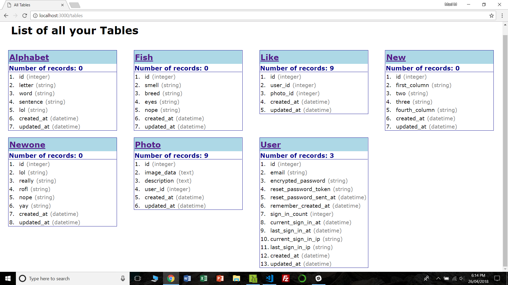
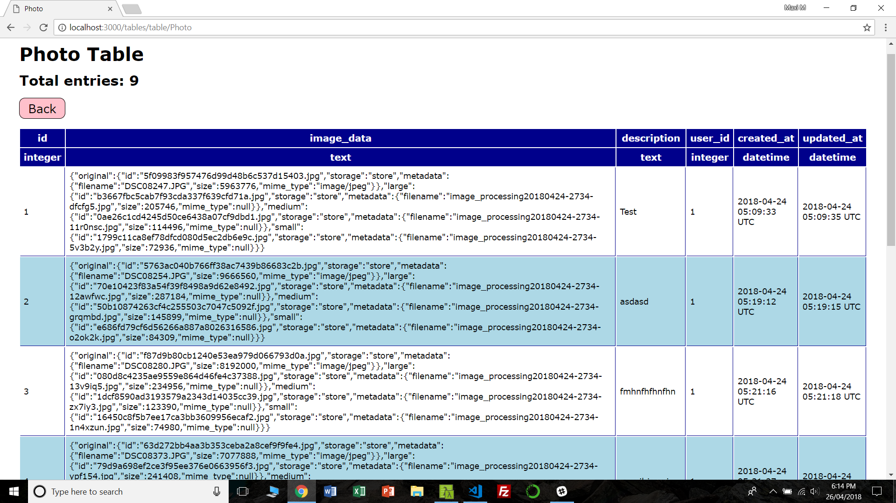
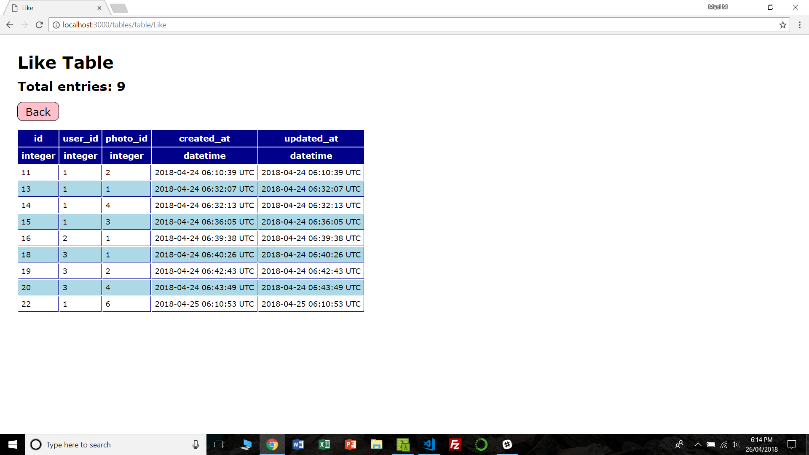

# Context

I developed this tool so me and my classmates could easily see the the tables and records in our databases as we made our Rails App. I found it very helpful for my project since it helped me quickly identify my column names and troubleshoot database problems.

# Database Helper

Do you want an easy way to see your rails database? Now you can!

Following the instructions below will let you visually navigate your rails database in your browser. You will be able to see:
1. All the tables in your database.
2. All the column headings of each table.
3. All the records of each table.







## Step 1: Run `rails g controller Tables all_tables table`
1. In your rails app terminal, execute `rails g controller Tables all_tables table`. This will create all the files you need.

## Step 2: Reconfigure routes in router

2. Delete `get 'tables/all_tables'` from **routes.rb**
3. Delete `get 'tables/table'` from **routes.rb**
4. Add `get '/tables', to: 'tables#all_tables'` to **routes.rb**
5. Add `get '/tables/table/:table_name', to: 'tables#table', as: 'table'` to **routes.rb**

## Step 3: Reconfigure **tables_controller.rb** controller

6. Delete all the contents of the **tables_controller.rb**
7. Copy-paste the following code into **tables_controller.rb**:

```ruby
class TablesController < ApplicationController
  
  def all_tables
    Rails.application.eager_load!
    dummy_count = 0
    model_array = []    
    ActiveRecord::Base.descendants.each do |model|
      if model == ApplicationRecord || model == ActiveRecord::SchemaMigration
        dummy_count += 1 # This doesn't do anything. I just don't know how else to skip the first two objects in ActiveRecord::Base.descendants
      else
        model_array.push(model.to_s)
      end
    end
    model_array.sort!
    @all_models = model_array
    render layout: false    
  end

  def table
    @model = params.permit(:table_name)[:table_name]

    render layout: false
  end

end
```

## Step 4: Reconfigure the **all_tables.html.erb** view in app/views/tables

8. Delete all the contents of the **all_tables.html.erb** in app/views/tables
9. Copy-paste the following code into **all_tables.html.erb**:

```erb
<!DOCTYPE html>
<html lang="en">
<head>
  <meta charset="UTF-8">
  <meta name="viewport" content="width=device-width, initial-scale=1.0">
  <meta http-equiv="X-UA-Compatible" content="ie=edge">
  
  <style type="text/css">

    * {
      /* border: 1px solid red; */
      border: 1px solid transparent;
      margin: 0px;
      padding: 0px;
      box-sizing: border-box;
      font-family: verdana;
    }
    
    .clearfix {zoom: 1}
    .clearfix:after {
      content: "";
      clear: both;
      display: block;
      height: 0;
      visibility: hidden;
    }

    h1 {
      padding: 30px;
    }

    h2 {
      color: darkblue;
      background: lightblue;
      padding: 5px 0;
    }

    h3 {
      color: darkblue;
      border-bottom: 1px solid darkblue;
    }

    .one-table {
      display: inline-block;
      width: 21.5%;
      margin: 10px 1.5%;
      padding: 0px;
      vertical-align: top;
      border: 1px solid darkblue;
    }

    .number {
      display: inline-block;
      width: 30px;
    }

    .type {
      color: grey;
    }

 </style>

  <title>All Tables</title>
</head>
  <body>

    <h1>List of all your Tables</h1>
    
    <% @all_models.each do |model| %>

      <%# Converts the string to the model name %>
      <% model = model.constantize %>
      
       
      <div class="one-table clearfix">
      <h2><%= link_to model, table_path(model), method: :get %></h2>
      <h3>Number of records: <%= model.all.count %></h3>
      <% count = 1 %>
      <p><% model.columns_hash.each do |column_heading, column_type| %></p>
        <div class="column_name"><span class="number"><%= "#{count}." %></span><span class="heading"><%= column_heading %></span> <span class="type">(<%= column_type.type %>)</span></div>
        <% count += 1 %>
      <% end %>
      </div>
    <% end %>

  </body>
</html>
```

## Step 5: Reconfigure the **table.html.erb** view in app/views/tables

10. Delete all the contents of the **table.html.erb** in app/views/tables
11. Copy-paste the following code into **table.html.erb**:

```erb
<!DOCTYPE html>
<html lang="en">
<head>
  <meta charset="UTF-8">
  <meta name="viewport" content="width=device-width, initial-scale=1.0">
  <meta http-equiv="X-UA-Compatible" content="ie=edge">
  
  <style type="text/css">

    * {
      /* border: 1px solid red; */
      border: 1px solid transparent;
      margin: 0px;
      padding: 0px;
      box-sizing: border-box;
      font-family: verdana;
    }
    
    .clearfix {zoom: 1}
    .clearfix:after {
      content: "";
      clear: both;
      display: block;
      height: 0;
      visibility: hidden;
    }

    body {
      margin: 30px;
    }

    h1 {
      margin-bottom: 10px;
    }

    h2 {
      margin-bottom: 20px;
    }

    .nav-button {
      margin-bottom: 20px;
      font-size: 20px;
    }

    .nav-button a:link,
    .nav-button a:visited {
      padding: 5px 15px;
      border: 1px solid black;
      border-radius: 10px;
      background: pink;
      text-decoration: none;
      color: black;
    }

    th {
      padding: 5px;
      border-bottom: 1px solid darkblue;
      border-right: 1px solid darkblue;
      color: white;
      background: darkblue;
    }

    td {
      padding: 5px;
      border-bottom: 1px solid darkblue;
      border-right: 1px solid darkblue;
      font-size: 14px;
    }

    tr:nth-child(even) {
      background: lightblue;
    }

    td:hover {
      background: lightgreen;
    }

 </style>

  <title><%= @model %></title>
</head>
<body>
  
</body>
</html>

<h1><%= @model %> Table</h1>

<% @model = @model.constantize %>

<h2>Total entries: <%= @model.all.count %> </h2>

<div class="nav-button"><%= link_to 'Back', tables_path %></div>

<table>
  <tr>
    <% @model.column_names.each do |column_heading| %>
    <th><%= column_heading %></th>
    <% end %>
  </tr>

  <tr>
    <% @model.columns_hash.each do |column_heading, column_type| %>
    <th><%= column_type.type %></th>
    <% end %>
  </tr>

  <% @model.all.each do |table_row| %>
    <tr>
      <% @model.column_names.each do |column_heading| %>
        <td><%= table_row.send(column_heading) %></td>
      <% end %>
    </tr>
  <% end %>

</table>
```

## That's it! You're ready to go!
12. Create some models and run `rails db:migrate`
13. Start the rails server
14. Navigate to **http://localhost:3000/tables** to see all the tables in your database!
15. Click on a table heading to see all the records in that table!

# DON'T FORGET!!!!!
run `rails destroy controller Tables all_tables table` before you deploy your website. 

You will also need to remove:

`get '/tables', to: 'tables#all_tables'` from **routes.rb**

`get '/tables/table/:table_name', to: 'tables#table', as: 'table'` from **routes.rb**

This will remove the ability to navigate your database through the browser. If you don't run this command and remove the routes, your users will be able to browse through the contents of your database.